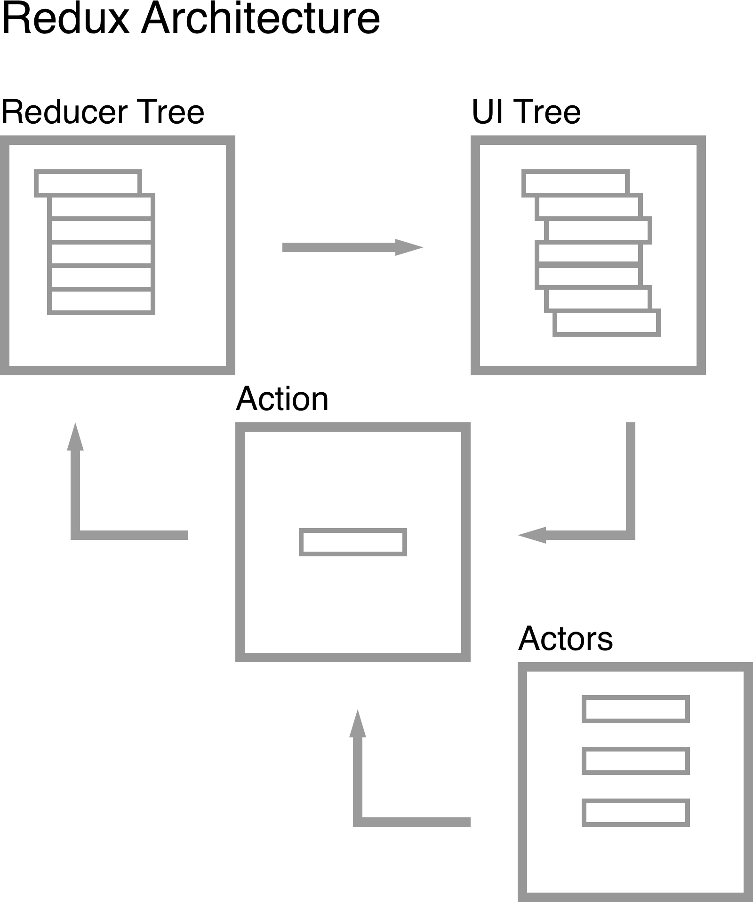

This audio guide is structured to have a single direction data flow architecture. To accomplish this it uses Redux for state management, React Native for view layout and construction and Actors to handle events not triggered by the UI, for example when new Beacons are detected.

Because this is still a very new architecture pattern, especially in the mobile space, I suggest you do some reading and learning up before tackling the codebase.

I suggest you watch:
[Getting Started With Redux](https://egghead.io/courses/getting-started-with-redux)

And read the Redux docs as they are excellent, specifically the whole Basics section.
[Basics](https://redux.js.org/docs/basics/)

Because I know your time is limited I also included a very brief introduction below:

### Reducer Tree
A reducer is a function that given an action and the current state will calculate the next state. Reducers are bundled by functionality, so that each functionality related to tour stops or beacons will have seperate reducers. After all the reducers run, their state is combined into a single state. This is then passed to the UI Tree to render.

The reducers can be found in the [app/reducers folder](../app/reducers).

*Notes:*  

1. These need to be pure functions. It will break Redux if they are not. So no async execution in reducers or anything that could fail. Use actions instead for async execution.

### UI Tree
The UI is separated into components.

There are two different component types:  

1. Normal Components: These are components that have no connection to any Reducer. The only data they recieve are the data passed into them on creation.
2. Containers: These are components that bind certain parts of the state to props and actions to a component. They are the only part of the UI that is aware of Reducers.

The components can be found in the [app/components folder](../app/components).

The containers binding can be found in the [app/containers folder](../app/containers), while the actual component it binds to can be found out by the component the contrainer imports. e.g.[ Setting Screen Container.](../app/containers/settings.js#L5)

*Notes:*  

1. Use as few containers as possible. This will increase the portability and stabitity of your code.  
2. Try to make most of your UI Components deterministic/stateless. (Avoid state outside of your Reducers).  

### Action
An action is the only way to modify the state. Each action specifies its action type and the data associated with that action. They handle async calls and then pass the returned data into the Reducers by returning an Action type that certain reducers will listen to and then modify their specific part of the state tree.

The actions can be found in the [app/containers folder](../app/containers)

*Notes:*  

1. Only one Action should be triggered at a time. Actions should not be tied to UI or a specific Reducer. This is an antipattern that will lead to tightly coupled Actions and Reducers and ultimately leads to more code then is nessecary. It is perfectly fine for an action to hit multiple reducers.  
2. To handle actions that can fail have an action that returns either a fail action or a success action. e.g. [A load audio action could fail](../app/actions/audio.js#L139). (Dispatch is the way to send an action, redux normally wraps your actions in dispatch automatically when you pass them through containers.)

### Actors
An actor is an unit that is completely independent of the UI, it merely listens for events and using the data passed in and currently in the state it sends an action.

The actors can be found in the [app/actors folder](../app/actors)

*Notes:*

1. This is a personal addition to standard Redux archecture. It helps separate out the events that are not UI dependent from the ones that are.
